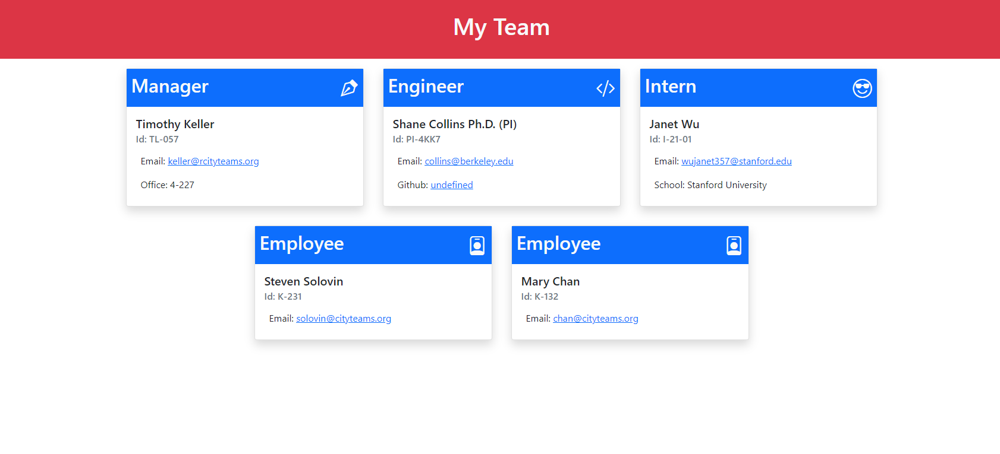
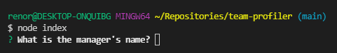
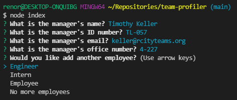
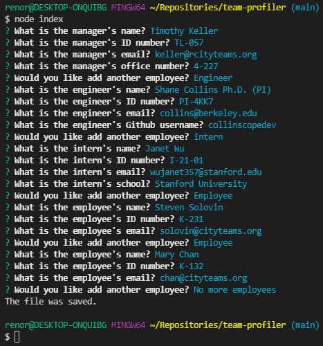

# Team Profile Generator

## Description 

If you are a project manager, a staff coordinator, a consulant, or any one else who is tired of

* staring at spreadsheets for things like scheduling, staff data etc.
* losing track of team players 
* losing track of digital records
* misplaced files on Google drive
* depending on third party services for all of the above

Please read on.

The success of a production team is strongly dependent on its organization. Project managers and administrative staff in such diverse fields as software engineering to residential construction need easy and quick access to important information related to their team members. Additionally, to facilitate a highly cooperative working relationship between team members, managers and administrative staff must assure the team they have the same easy access to necessary information about each other. Moreover, this information must be kept up to date.  

For these reasons, it is important that updates to team staff data must be easy to implement, fast and efficient. This project represents some first steps in this direction. In this project, we feature a command line tool which allows a project manager, or administrative staff person to quickly enter important information for each of the project contributors. 

### Examples included in this project:
* Employee Name
* Title or Responsibily 
* Employee Identification Number
* Email
* Github (where relevant)

The information is gathered through a simple user interface and the results, for each team member, are neatly displayed on a webpage which is 'mobile device friendly'. 
  
This project is intended to be somewhat of a 'proof of concept' which could lay the groundwork for a more comprehensive set of features. 

Still interested?

## Plan

We cover the basics of

* [Installation](#installation)
* [Usage](#usage)
* [Features](#features)
* [Credits](#credits) 

  

## Installation

To obtain a workable version of this application, you will need to obtain some version of a command line tool. This application was developed and tested on a Windows 10 platform using Git Bash 2.32. It is a package for windows that includes 'git' and 'bash'. You can find a nice description of Git and Bash as well as the Git Bash installation procedure [here](https://www.stanleyulili.com/git/how-to-install-git-bash-on-windows/). 

It is also understood that workable versions of similar applications have been obtained on Apple machines, but I am still testing that. Additionaly, deployments using Linux and Windows Powershell are still being tested. 

Once you have access to a command line, you will also need to install Node.js. This app was developed in Node.js v16.3.0. A good discussion of how to do that can be found [here](https://developer.ibm.com/languages/node-js/tutorials/learn-nodejs-installing-node-nvm-and-vscode/). 

Once you have Node.js working from the command line, follow the instructions to get a working version on your machine:

* Download this repository and store the files in the same folder which we will call 'tpg'. 
* Navigate to tpg and open a command line there and invoke Node.js.
* You will need to issue the command 'npm install' to install the package dependencies which do not ship with this application.
* Once done, you are ready to use the application. 

  

 

## Usage 

If you have successfully worked through the steps above, follow these steps to use the application. 

1. In the directory tpg (above), open the command window. If you have not already done so, issue the command 'npm install'. 
2. Start the application by issuing the command "node index.". You should see a prompt at the terminal similar to the one indicated in the screenshot 

3. All employees are here asked to provide name, ID, and email. The manager is asked for the office number, engineers for the Github name, and interns for their school. You can now enter the information at the terminal prompt for the MANAGER of the project. (This application assumes there is only one manager, but other variants are easily obtained.) When done, you will be prompted whether you would like to add additional employees, engineers, or interns to the project.     
            

4. You can continue adding as many engineers, employees and interns as you like. In our little example, let's say Tim's project has one engineer working with one intern and two administrative staff assistants. When finished entering their information, select 'No more employees'. You should see some thing like 
5. You can view the finished product in the same directory. It is listed as 'test.html'. This can be viewed by using your favorite browser to open the file. 

## Features

* This application was developed using JavaScript ES5 and ES6, Node.js, and HTML with Bootstrap.
* We use the 'flex-wrap' feature from Bootstrap to enable wrapping of the cards when the browser is resized.
*  The logic of the user interface was implimented via the [inquirer Node](https://www.npmjs.com/package/inquirer) package. 
*  Basic tests for the application were developed using the Node package [Jest](https://www.npmjs.com/package/jest).
*  A brief video demonstrating the validation tests and the application's use can be found here.[https://www.loom.com/share/df280dbf00124bc2b3f548a00884e8b2](https://www.loom.com/share/df280dbf00124bc2b3f548a00884e8b2)
*  HTML example file is included in the [example](example.html) and a rendered example [here](https://palexander227.github.io/sample-html/).

## Credits  

* I thank the instructors at the UC Berkeley Coding Bootcamp for inspiring such a clever and useful working tool.
* I thank my wife for tolerating me while I developed it.

## Tests

In the tests of this application, I discoverd an error in the jest package. It does not recognize the inheritance of an extension class. This problem is well known and in the tests it is documented. I will update this note when I know more.

---

